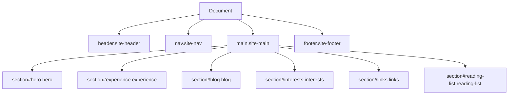

# Design Document: GitHub Profile Page

## Overview

This design describes the rebuild of gilleswb.github.io from an outdated table-based HTML layout into a modern, responsive, single-page professional profile site. The site is built with pure HTML5, CSS3, and minimal vanilla JavaScript — no frameworks or build tools required. It targets recruiters and hiring managers evaluating Gilles W Bassole for SDE, Systems Developer, and Solutions Architect roles.

The design prioritizes:
- Semantic HTML for accessibility and SEO
- CSS custom properties and modern layout (Grid/Flexbox) for maintainability
- Progressive enhancement — all content visible without JavaScript
- Fast load times on any connection (< 3 MB total page weight)
- Mobile-first responsive design

## Architecture

### File/Folder Structure

```
gilleswb.github.io/
├── index.html                  # Main single-page profile
├── css/
│   └── styles.css              # All styles (custom properties, layout, components)
├── js/
│   └── main.js                 # Navigation behavior (hamburger menu, smooth scroll, active link)
├── blog/
│   ├── index.html              # Blog listing page (optional, mirrors Blog_Section)
│   └── posts/
│       └── YYYY-MM-DD-slug.html  # Individual blog post pages
├── images/
│   ├── favicon.png             # Existing favicon
│   ├── gilles-bassole.jpg      # Existing profile photo
│   └── ...                     # Any future images
├── data/
│   └── Bassole_Resume.pdf      # Existing resume PDF
└── CNAME                       # GitHub Pages custom domain config
```

**Rationale:**
- Separating CSS and JS into their own folders keeps the root clean and allows caching.
- Blog posts live in `blog/posts/` as individual HTML files, each self-contained with a shared layout structure. This avoids any build step while keeping posts navigable.
- The `images/` and `data/` folders are preserved from the existing structure to avoid breaking any external links.

### Technology Decisions

| Decision | Choice | Rationale |
|----------|--------|-----------|
| Layout system | CSS Grid + Flexbox | Modern, no tables for layout. Grid for page-level structure, Flexbox for component alignment |
| Fonts | System font stack + Lato (Google Fonts) | Lato is already in use; system fonts as fallback reduce load time |
| JavaScript | Vanilla ES6 (no framework) | Only needed for hamburger toggle, smooth scroll, and active nav highlighting |
| Blog posts | Individual HTML files | No build tool needed; each post is a standalone page with consistent header/footer |
| Responsive approach | Mobile-first with breakpoints | Start with single-column, enhance for wider viewports |
| CSS methodology | BEM-lite naming + custom properties | Readable, maintainable, no preprocessor needed |

## Components and Interfaces

### Page Layout (index.html)



### Component Breakdown

#### 1. Navigation Bar (`nav.site-nav`)

```html
<nav class="site-nav" role="navigation" aria-label="Main navigation">
  <div class="site-nav__container">
    <a href="#hero" class="site-nav__brand">GB</a>
    <button class="site-nav__toggle" aria-expanded="false" aria-controls="nav-menu" aria-label="Toggle navigation menu">
      <span class="site-nav__hamburger"></span>
    </button>
    <ul id="nav-menu" class="site-nav__list">
      <li><a href="#hero" class="site-nav__link site-nav__link--active">About</a></li>
      <li><a href="#experience" class="site-nav__link">Experience</a></li>
      <li><a href="#blog" class="site-nav__link">Blog</a></li>
      <li><a href="#interests" class="site-nav__link">Interests</a></li>
      <li><a href="#links" class="site-nav__link">Links</a></li>
      <li><a href="#reading-list" class="site-nav__link">Reading List</a></li>
    </ul>
  </div>
</nav>
```

**Behavior:**
- Sticky positioning (`position: sticky; top: 0`)
- On mobile (< 768px): hamburger button toggles `nav-menu` visibility via `aria-expanded` and a CSS class
- Smooth scroll via `scroll-behavior: smooth` on `html` element (CSS-only, JS fallback for Safari)
- Active link highlighting via Intersection Observer in JS

#### 2. Hero Section (`section#hero`)

```html
<section id="hero" class="hero" aria-labelledby="hero-heading">
  <div class="hero__container">
    <div class="hero__content">
      <h1 id="hero-heading" class="hero__name">Gilles W Bassole</h1>
      <p class="hero__title">SDE · Systems Developer · Solutions Architect</p>
      <p class="hero__summary"><!-- 2-3 sentence professional summary --></p>
      <div class="hero__actions">
        <a href="data/Bassole_Resume.pdf" target="_blank" rel="noopener noreferrer" class="hero__resume-btn">Download Resume</a>
      </div>
      <ul class="hero__social" aria-label="Social links">
        <li><a href="https://linkedin.com/in/bgwilf" target="_blank" rel="noopener noreferrer">LinkedIn</a></li>
        <li><a href="https://github.com/bgwilf" target="_blank" rel="noopener noreferrer">GitHub</a></li>
        <li><a href="https://twitter.com/bgwilf" target="_blank" rel="noopener noreferrer">Twitter</a></li>
        <li><a href="mailto:bassolegilles@gmail.com">Email</a></li>
      </ul>
    </div>
    <div class="hero__photo">
      
    </div>
  </div>
</section>
```

**Layout:** On desktop (≥ 768px), content and photo sit side-by-side using CSS Grid (`grid-template-columns: 1fr auto`). On mobile, they stack vertically with the photo above the text.

#### 3. Experience Section (`section#experience`)

```html
<section id="experience" class="experience" aria-labelledby="experience-heading">
  <h2 id="experience-heading" class="section-heading">Experience</h2>
  <div class="experience__timeline">
    <article class="experience__role experience__role--current">
      <div class="experience__header">
        <h3 class="experience__title">Alexa Developer Advocate</h3>
        <span class="experience__badge">Current</span>
      </div>
      <p class="experience__meta">Amazon · London, UK · Jan 2022 – Present</p>
      <ul class="experience__achievements">
        <li>...</li>
      </ul>
      <p class="experience__skills">Skills: Java, Python, Alexa Skills Kit, AWS Lambda, OAuth/LWA</p>
    </article>
    <!-- Additional roles... -->
  </div>
</section>
```

**Layout:** Single-column timeline with a left border accent. Current role gets a distinct background color or badge. Each role is an `<article>` for semantic grouping.

#### 4. Blog Section (`section#blog`)

```html
<section id="blog" class="blog" aria-labelledby="blog-heading">
  <h2 id="blog-heading" class="section-heading">Blog</h2>
  <div class="blog__list">
    <article class="blog__entry">
      <h3 class="blog__title"><a href="blog/posts/2024-01-15-post-slug.html">Post Title</a></h3>
      <time class="blog__date" datetime="2024-01-15">January 15, 2024</time>
      <p class="blog__summary">Summary text (max 150 chars)...</p>
    </article>
    <!-- Max 10 entries -->
  </div>
  <!-- Placeholder when no posts exist -->
  <!-- <p class="blog__placeholder">Blog posts coming soon.</p> -->
</section>
```

**Blog Post Pages** (`blog/posts/YYYY-MM-DD-slug.html`):
Each blog post is a standalone HTML file sharing the same `<head>` setup (favicon, stylesheet link) and a simplified navigation (back link to main page). Structure:

```html
<!DOCTYPE html>
<html lang="en">
<head><!-- shared meta, css link --></head>
<body>
  <header class="post-header">
    <a href="../../index.html#blog" class="post-header__back">← Back to profile</a>
  </header>
  <main class="post-content">
    <article>
      <h1>Post Title</h1>
      <time datetime="2024-01-15">January 15, 2024</time>
      <div class="post-content__body">
        <!-- Post content in semantic HTML -->
      </div>
    </article>
  </main>
  <footer class="site-footer"><!-- shared footer --></footer>
</body>
</html>
```

#### 5. Interests Section (`section#interests`)

```html
<section id="interests" class="interests" aria-labelledby="interests-heading">
  <h2 id="interests-heading" class="section-heading">Interests</h2>
  <div class="interests__grid">
    <div class="interests__category">
      <h3 class="interests__category-title">Cloud & Infrastructure</h3>
      <ul class="interests__list">
        <li class="interests__item">
          <strong>Serverless Architecture</strong>
          <span>Building event-driven systems with AWS Lambda and Step Functions</span>
        </li>
        <!-- More items -->
      </ul>
    </div>
    <!-- More categories -->
  </div>
</section>
```

**Layout:** CSS Grid with `auto-fill` columns for categories, wrapping naturally on smaller screens.

#### 6. Links Section (`section#links`)

```html
<section id="links" class="links" aria-labelledby="links-heading">
  <h2 id="links-heading" class="section-heading">Useful Links</h2>
  <div class="links__categories">
    <div class="links__category">
      <h3 class="links__category-title">Developer Tools</h3>
      <ul class="links__list">
        <li class="links__item">
          <a href="https://..." target="_blank" rel="noopener noreferrer" class="links__url">Tool Name</a>
          <p class="links__description">Brief description (max 150 chars)</p>
        </li>
      </ul>
    </div>
  </div>
</section>
```

#### 7. Reading List Section (`section#reading-list`)

```html
<section id="reading-list" class="reading-list" aria-labelledby="reading-list-heading">
  <h2 id="reading-list-heading" class="section-heading">Reading List</h2>
  <ul class="reading-list__entries">
    <li class="reading-list__entry">
      <a href="https://..." target="_blank" rel="noopener noreferrer" class="reading-list__name">Blog/Publication Name</a>
      <p class="reading-list__description">1-2 sentence description (max 200 chars)</p>
    </li>
  </ul>
</section>
```

#### 8. Footer (`footer.site-footer`)

```html
<footer class="site-footer" role="contentinfo">
  <p>© 2024 Gilles W Bassole · London, UK</p>
</footer>
```

## Data Models

This is a static site with no database or API. Content is authored directly in HTML. The "data model" is the HTML structure itself:

### Content Entities

| Entity | Storage | Fields |
|--------|---------|--------|
| Profile | `index.html` Hero section | name, title, summary, photo path, social links |
| Experience Role | `index.html` Experience section | company, title, dateRange, location, achievements[], skills[] |
| Blog Post Entry | `index.html` Blog section | title, date, summary, linkToPost |
| Blog Post (full) | `blog/posts/*.html` | title, date, body content |
| Interest | `index.html` Interests section | category, name, description |
| External Link | `index.html` Links section | category, title, url, description |
| Reading Entry | `index.html` Reading List section | name, url, description |

### CSS Custom Properties (Design Tokens)

```css
:root {
  /* Colors */
  --color-primary: #1772d0;
  --color-primary-hover: #f09228;
  --color-text: #1a1a2e;
  --color-text-muted: #555;
  --color-bg: #ffffff;
  --color-bg-alt: #f8f9fa;
  --color-border: #e0e0e0;
  --color-accent: #1772d0;

  /* Typography */
  --font-family: 'Lato', -apple-system, BlinkMacSystemFont, 'Segoe UI', sans-serif;
  --font-size-base: 16px;
  --font-size-sm: 14px;
  --font-size-lg: 18px;
  --font-size-h1: 36px;
  --font-size-h2: 28px;
  --font-size-h3: 22px;
  --line-height: 1.6;

  /* Spacing (8px base unit) */
  --space-xs: 4px;
  --space-sm: 8px;
  --space-md: 16px;
  --space-lg: 32px;
  --space-xl: 48px;
  --space-2xl: 64px;
  --space-section: 80px;

  /* Layout */
  --max-width: 900px;
  --nav-height: 60px;
  --border-radius: 6px;

  /* Transitions */
  --transition-fast: 150ms ease;
  --transition-normal: 250ms ease;
}
```

### Responsive Breakpoints

| Breakpoint | Width | Layout Changes |
|-----------|-------|----------------|
| Mobile | < 768px | Single column, hamburger nav, stacked hero |
| Tablet/Desktop | ≥ 768px | Multi-column hero, side-by-side layouts, horizontal nav |
| Large Desktop | ≥ 1200px | Max-width container centered, larger spacing |

## Error Handling

Since this is a static site, error handling is minimal but important for robustness:

### Image Load Failure
- All `` elements include descriptive `alt` text (≥ 5 characters)
- CSS sets a neutral background color on image containers so broken images don't leave blank gaps
- The profile photo uses `width` and `height` attributes to prevent layout shift

### Resume PDF Unavailability
- The resume link (`data/Bassole_Resume.pdf`) opens in a new tab; if the file is missing, the browser shows its native 404 page
- A `title` attribute on the link provides additional context: "Download Gilles Bassole's resume (PDF)"
- The link remains visible and clickable for retry

### JavaScript Disabled
- All content is rendered in HTML — no JS required to view any section
- Navigation links use standard `#anchor` hrefs that work without JS (instant jump instead of smooth scroll)
- The hamburger menu is hidden by default on desktop; on mobile, CSS `:target` or a `<details>` fallback can provide no-JS menu access
- The `<noscript>` tag is not needed since the page is fully functional without JS

### Font Loading
- System font stack as fallback ensures text is always readable
- `font-display: swap` on the Lato `@font-face` declarations prevents invisible text during load

## Testing Strategy

### Why Property-Based Testing Does Not Apply

This feature is a static HTML/CSS page with minimal JavaScript for navigation behavior. It falls squarely into categories where PBT is not appropriate:

- **UI rendering and layout** — the primary deliverable is visual presentation
- **Static content display** — content is hardcoded in HTML, not computed from inputs
- **CSS styling** — visual properties are not functions with variable inputs
- **Minimal JS** — the JavaScript handles DOM toggling and scroll observation, not data transformation

There are no pure functions with meaningful input variation, no serialization/parsing, no algorithms, and no business logic to validate with property-based tests.

### Recommended Testing Approach

#### Manual Visual Testing
- Open `index.html` in Chrome, Firefox, Safari, and Edge
- Test at viewport widths: 320px, 375px, 768px, 1024px, 1440px, 2560px
- Verify no horizontal overflow at any width
- Verify navigation behavior (sticky, smooth scroll, hamburger toggle)

#### Accessibility Testing
- Run axe DevTools or Lighthouse accessibility audit (target score ≥ 90)
- Verify keyboard navigation: Tab through all interactive elements, confirm visible focus indicators
- Test with VoiceOver (macOS) or NVDA (Windows) to confirm ARIA landmarks and heading hierarchy
- Verify color contrast ratios meet WCAG AA (4.5:1 for body text, 3:1 for large text/UI)

#### Performance Testing
- Run Lighthouse performance audit
- Verify total page weight < 3 MB
- Verify initial HTML load < 2 seconds on throttled 3G (Chrome DevTools network throttling)
- Confirm images have explicit dimensions to prevent layout shift

#### Link Validation
- Verify all external links open in new tabs (`target="_blank"` with `rel="noopener noreferrer"`)
- Verify resume PDF link resolves correctly
- Verify all `#anchor` navigation links scroll to the correct section

#### Responsive Behavior Checks
- Verify hero section is fully visible without scrolling on ≥ 768px viewports
- Verify single-column stacking on < 768px
- Verify touch targets ≥ 44x44px on mobile
- Verify hamburger menu opens/closes correctly and is keyboard accessible

#### HTML Validation
- Run W3C HTML validator on `index.html` and blog post pages
- Confirm no table elements used for layout
- Confirm semantic elements used correctly (header, nav, main, section, article, footer)
